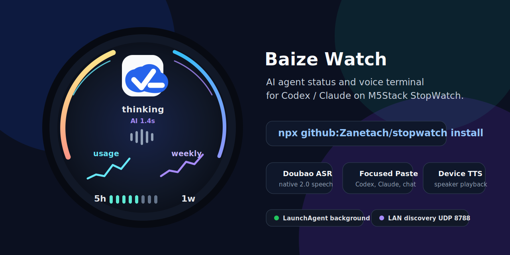
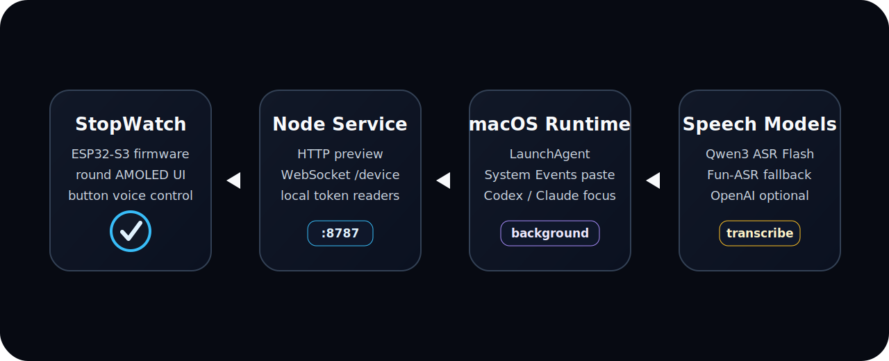

# Baize Watch

<p align="center">
  
</p>

Baize Watch is a local desktop companion for Codex and Claude Code. The project combines an ESP32-S3 round-screen firmware UI, a Node.js macOS service, local token readers, LAN discovery, speech recognition, text insertion, and device speaker playback.

The core idea is deliberately local-first: the device talks to your Mac over LAN, the Mac reads local Codex / Claude Code state when available, and voice dictation is pasted into the currently focused desktop input.

## Current Capabilities

| Area | What is implemented |
|---|---|
| Device dashboard | Codex and Claude Code faces, 3D logo assets, token trend charts, 5h / 1w usage windows, voice state, thinking animation, and status ring |
| Desktop service | HTTP dashboard, `/status`, `/voice`, `/speak`, WebSocket `/device`, WebSocket `/client`, and UDP LAN discovery |
| Token data | Codex SQLite/session JSONL readers, Claude Code project JSONL reader, freshness checks, trend buckets, and manual override support |
| Voice dictation | One-shot Chinese dictation into the focused input, app targeting for Codex, Claude Code, WeChat, Feishu, Terminal, and generic chat windows |
| Conversation mode | Wake greeting, continuous listen/reply loop, assistant thinking state, Baize Watch speaker TTS, and conversation export to the focused input |
| macOS service | `baize-watch` CLI, LaunchAgent install, restart/status/log commands, local env file, and System Events paste/send automation |
| Firmware | PlatformIO firmware for the Baize Watch ESP32-S3 device using M5Unified, ArduinoJson, ArduinoWebsockets, WiFiManager, and on-device Wi-Fi setup |

## System Shape

<p align="center">
  
</p>

The project is split into a narrow firmware surface and a richer desktop runtime:

| Layer | Responsibility |
|---|---|
| `firmware/src/main.cpp` | Round-screen UI, button/touch flows, microphone capture, speaker playback, LAN discovery, and WebSocket device protocol |
| `server/index.js` | HTTP/WebSocket monitor service, status aggregation, voice session coordination, TTS dispatch, and device broadcast |
| `server/stt.js` | ASR providers: Doubao native ASR 2.0, Doubao gateway ASR, Aliyun DashScope realtime ASR, Qwen/Fun-ASR fallback, and OpenAI transcription |
| `server/tts.js` | Doubao Speech TTS and Aliyun CosyVoice TTS synthesis into PCM for Baize Watch playback |
| `server/assistant.js` | Short assistant replies for continuous conversation through Aliyun-compatible or Doubao-compatible chat APIs |
| `server/voice-intent.js` | Command normalization, app routing, exit phrases, and common ASR correction rules |
| `server/cli.js` | Foreground start, macOS LaunchAgent install/uninstall/restart/status/log commands |

## Quick Start

From GitHub:

```bash
npx github:Zanetach/baize-watch install
```

From a local checkout:

```bash
git clone https://github.com/Zanetach/baize-watch.git
cd baize-watch
npm install
npm start
```

Open the browser dashboard:

```text
http://localhost:8787
```

The desktop service also answers Baize Watch LAN discovery on UDP `8788`, so the firmware can discover the current Mac LAN address after the device has been flashed once.

## Background Service

The CLI can run the monitor in the foreground or install it as a macOS LaunchAgent.

```bash
baize-watch start
baize-watch install
baize-watch status
baize-watch restart
baize-watch stop
baize-watch logs
baize-watch uninstall
```

The installer writes local runtime files outside the repository:

| Path | Purpose |
|---|---|
| `~/.baize-watch/env` | Local runtime config and API keys |
| `~/.baize-watch/agent-status.json` | Optional manual Codex / Claude Code status overrides |
| `~/.baize-watch/claude-statusline.json` | Optional Claude Code official subscription rate-limit snapshot |
| `~/Library/LaunchAgents/com.zane.baize-watch.plist` | macOS background service |
| `~/.baize-watch/baize-watch.log` | Service stdout |
| `~/.baize-watch/baize-watch.err.log` | Service stderr |

The npm package is not published yet. The current install surface is the npm-style GitHub CLI plus LaunchAgent.

## Voice Modes

Baize Watch has two voice workflows. They are intentionally separate so casual conversation does not accidentally paste text into a work chat.

| Mode | Entry | Behavior |
|---|---|---|
| Dictation/input | Double-press left | Record one instruction, transcribe Chinese, normalize command text, paste into the focused Codex, Claude Code, Terminal, WeChat, Feishu, or other chat input, then wait for right-button send |
| Conversation assistant | Double-press right | Speak `我是傻妞，你的智能秘书。`, listen, transcribe, reply through the device speaker, show thinking state while the model/TTS is working, then resume listening |

Button behavior on the dashboard:

| Control | Action |
|---|---|
| Single-press left on the dashboard | Cycle between Codex and Claude Code after the double-press window passes |
| Double-press left | Start one-shot dictation/input mode |
| Double-press right | Wake the current face for continuous conversation |
| Short-press left while recording | Stop, transcribe, and process the current turn |
| Press right when transcript is ready | Send Return in the focused input |
| Long-press while recording | Exit the active voice session |

Focused-input automation uses macOS System Events. Terminal, your Node runtime, or the active host application may need Accessibility permission before paste/send works.

## Runtime Configuration

Default generated environment:

```bash
MONITOR_STT_PROVIDER=doubao-native
MONITOR_DOUBAO_NATIVE_ASR_MODEL=bigmodel
MONITOR_DOUBAO_NATIVE_ASR_RESOURCE_ID=volc.seedasr.sauc.duration
MONITOR_DOUBAO_NATIVE_ASR_CHUNK_INTERVAL_MS=0
DOUBAO_ASR_APP_ID=your-app-id
DOUBAO_ASR_ACCESS_TOKEN=your-access-token
MONITOR_STATUS_SLOW_CACHE_MS=5000
MONITOR_VOICE_MIN_RECORDING_MS=900
MONITOR_VOICE_MIN_RMS=0
MONITOR_ASSISTANT_ENABLED=1
MONITOR_FOCUSED_DICTATION=1
MONITOR_ASSISTANT_PROVIDER=aliyun
MONITOR_ASSISTANT_MODEL=qwen-plus
MONITOR_ASSISTANT_MAX_TOKENS=40
MONITOR_TTS_PROVIDER=aliyun
MONITOR_ALIYUN_TTS_MODEL=cosyvoice-v3-flash
MONITOR_ALIYUN_TTS_VOICE=longwanjun_v3
MONITOR_ALIYUN_TTS_SAMPLE_RATE=16000
MONITOR_ALIYUN_TTS_VOLUME=100
MONITOR_TTS_CHUNK_BYTES=4096
MONITOR_TTS_GAIN=4.8
MONITOR_DEVICE_WAKE_CUE=0
MONITOR_WAKE_GREETING=我是傻妞，你的智能秘书。
MONITOR_WAKE_TTS_VOLUME=100
MONITOR_WAKE_TTS_GAIN=4.8
```

Provider support:

| Provider | Env | Notes |
|---|---|---|
| Doubao native ASR 2.0 | `MONITOR_STT_PROVIDER=doubao-native`, `DOUBAO_ASR_APP_ID`, `DOUBAO_ASR_ACCESS_TOKEN` | Uses the native Volcengine `bigmodel_nostream` WebSocket API |
| Doubao gateway ASR | `MONITOR_STT_PROVIDER=doubao`, `DOUBAO_ASR_API_KEY` | Optional gateway path |
| Aliyun DashScope ASR | `MONITOR_STT_PROVIDER=aliyun`, `DASHSCOPE_API_KEY` | Supports Qwen3 ASR Flash realtime and Fun-ASR fallback |
| OpenAI transcription | `MONITOR_STT_PROVIDER=openai`, `OPENAI_API_KEY` | Optional Audio Transcriptions API path |
| Aliyun chat | `MONITOR_ASSISTANT_PROVIDER=aliyun`, `MONITOR_ASSISTANT_MODEL=qwen-plus` | Default assistant reply path |
| Doubao chat | `MONITOR_ASSISTANT_PROVIDER=doubao`, `DOUBAO_CHAT_API_KEY`, `DOUBAO_CHAT_MODEL` | Ark/OpenAI-compatible assistant reply path |
| Aliyun TTS | `MONITOR_TTS_PROVIDER=aliyun` | Streams PCM from CosyVoice-compatible DashScope TTS |
| Doubao Speech TTS | `MONITOR_TTS_PROVIDER=doubao`, `MONITOR_DOUBAO_TTS_PROTOCOL=speech`, `DOUBAO_TTS_API_KEY`, `MONITOR_DOUBAO_TTS_RESOURCE_ID=seed-tts-2.0` | Uses Volcengine Doubao Speech `X-Api-Key` SSE TTS |

In the Volcengine native ASR 2.0 console, `APP ID` maps to `DOUBAO_ASR_APP_ID` and `Access Token` maps to `DOUBAO_ASR_ACCESS_TOKEN`. The monitor does not use the console `Secret Key` for the WebSocket transcription request.

Quality settings:

| Setting | Default | Purpose |
|---|---:|---|
| `MONITOR_STATUS_SLOW_CACHE_MS` | `5000` | Cache slow desktop readers while keeping CPU/time updates live |
| `MONITOR_FOCUSED_DICTATION` | `1` | Paste unknown speech into the current focused text input instead of sending it to the assistant |
| `MONITOR_ASSISTANT_MAX_TOKENS` | `40` | Keep continuous voice replies short so chat and TTS return faster |
| `MONITOR_VOICE_MIN_RECORDING_MS` | `900` | Reject accidental very short recordings before ASR |
| `MONITOR_VOICE_MIN_RMS` | `0` | Optional quiet-audio gate; keep `0` unless diagnostics show very low RMS |
| `MONITOR_TTS_CHUNK_BYTES` | `4096` | Send larger PCM chunks to reduce device WebSocket message overhead |
| `MONITOR_TTS_GAIN` | `4.8` | Boost Baize Watch speaker PCM output before sending audio chunks |
| `MONITOR_DEVICE_WAKE_CUE` | `0` | Use cloud TTS for the wake greeting; set `1` for a faster local cue |
| `MONITOR_WAKE_TTS_GAIN` | `4.8` | Separate gain for the wake greeting |

Test device speech without recording:

```bash
curl -X POST http://localhost:8787/speak \
  -H 'content-type: application/json' \
  -d '{"text":"你好，我在。"}'
```

## Token And Task Data

The service builds each agent status from local readers first, then optional manual overrides.

| Agent | Automatic source |
|---|---|
| Codex | `~/.codex/state_5.sqlite` and `~/.codex/sessions/**/*.jsonl` |
| Claude Code | `~/.claude/projects/**/*.jsonl`, plus optional Claude Code `statusLine` snapshots for official Claude.ai subscription limits |

For Claude Code, Baize Watch uses official subscription limit windows when Claude Code exposes `rate_limits` through its `statusLine` input. Without that field, it falls back to local rolling usage totals from project JSONL files.

Install the statusLine collector:

```bash
baize-watch install-claude-statusline
```

After the next Claude Code response, the collector writes `~/.baize-watch/claude-statusline.json`. If the snapshot includes official `five_hour` and `seven_day` rate-limit windows, the device shows the official reset labels. If not, the device shows `5h` / `7d` rolling usage.

Manual overrides live in `server/agent-status.json` for development or `~/.baize-watch/agent-status.json` for the LaunchAgent install.

```bash
cp server/agent-status.example.json server/agent-status.json
```

Supported token fields:

| Field | Meaning |
|---|---|
| `tokens.used` + `tokens.limit` | Absolute usage and limit |
| `tokens.percent` | Direct percentage |
| `tokenPercent` | Direct percentage alias |
| `trends.usage.total` + `trends.usage.points` | Short-window token trend |
| `trends.weekly.total` + `trends.weekly.points` | Weekly token trend |

Supported progress fields: `progress` and `progressPercent`.

## Firmware Setup

Install PlatformIO if needed:

```bash
python3 -m pip install platformio
```

Build firmware:

```bash
cd firmware
python3 -m platformio run
```

Flash firmware:

```bash
python3 -m platformio run -t upload
```

Serial monitor:

```bash
python3 -m platformio device monitor
```

For developer fallback credentials:

```bash
cp firmware/include/secrets.example.h firmware/include/secrets.h
```

Edit:

```cpp
#define WIFI_SSID "YOUR_WIFI_SSID"
#define WIFI_PASSWORD "YOUR_WIFI_PASSWORD"
#define MONITOR_WS_URL "ws://192.168.1.23:8787/device"
```

`MONITOR_WS_URL` is only a fallback. Baize Watch first broadcasts `baize-watch-discover-v1` on UDP `8788`; the desktop service replies with the current `ws://<mac-lan-ip>:8787/device` address. After this firmware is flashed once, normal Mac IP changes should not require another firmware burn.

Saved Wi-Fi credentials from the on-device setup flow take priority over `secrets.h`.

## Configuration Screen

| Control | Action |
|---|---|
| Long-press either programmable button | Open or exit the configuration screen |
| Left button moves selection | Move through configuration actions |
| Right button runs the selected action | Run Device WS reconnect, Wi-Fi setup, Wi-Fi portal, or exit |
| Tap a Wi-Fi name | Select a scanned Wi-Fi network during on-device Wi-Fi setup |
| Tap keyboard characters | Enter the password |
| Left button cycles | Move through Wi-Fi names or password characters |
| Long-press right connects | Connect after password entry |

The configuration screen includes Device WS reconnect, on-device Wi-Fi setup, fallback Wi-Fi portal, Device WebSocket connection state, voice state, device IP, WebSocket URL, and battery status. Device WS reconnect also reruns LAN discovery before using the fallback URL. The browser fallback starts the `BaizeWatch-Setup` access point; join it, select a scanned Wi-Fi network, enter the password, and let the device reconnect to the desktop WebSocket service.

## Browser Preview And API

| Route | Purpose |
|---|---|
| `/` | Browser dashboard preview |
| `/status` | Current desktop and agent status JSON |
| `/voice` | Voice controller state and active STT provider |
| `/speak` | Test or trigger device speech playback |
| `/device` | Baize Watch WebSocket endpoint |
| `/client` | Browser/client WebSocket endpoint |
| `/logos/*` | Codex and Claude Code logo assets |

| UDP | Purpose |
|---|---|
| `8788` | Baize Watch LAN discovery responder |

## Development

```bash
npm install
npm test
npm pack --dry-run
cd firmware && python3 -m platformio run
```

Useful local commands:

```bash
node bin/baize-watch.js --help
node bin/baize-watch.js start
curl http://localhost:8787/status
curl http://localhost:8787/voice
```

## Repository Layout

```text
bin/                         CLI entrypoint
server/                      Node.js monitor service, providers, routing, and tests
server/public/logos/         Browser and firmware logo source assets
firmware/                    PlatformIO ESP32-S3 firmware
firmware/include/            Generated RGB565 logo header and secrets example
scripts/generate_logo_header.py
docs/images/                 README artwork
```

## Logo Assets

Logo source files are stored under `server/public/logos/`:

- `codex-color.svg`
- `claudecode-color.svg`
- `codex-color.png`
- `claudecode-color.png`

Regenerate firmware logo arrays after replacing source logos:

```bash
rsvg-convert -w 48 -h 48 server/public/logos/codex-color.svg -o server/public/logos/codex-color.png
rsvg-convert -w 48 -h 48 server/public/logos/claudecode-color.svg -o server/public/logos/claudecode-color.png
python3 scripts/generate_logo_header.py
```

The logos remain trademarks of their respective owners. Keep them as product identifiers only; do not use them as this project's own brand.

## Notes

- The desktop service must be reachable from the Baize Watch device over the same LAN.
- macOS may ask for firewall and Accessibility permissions.
- `firmware/include/secrets.h`, `.env.local`, and runtime status files are intentionally ignored.
- No Homebrew formula is included yet.
- No license file is included yet.
